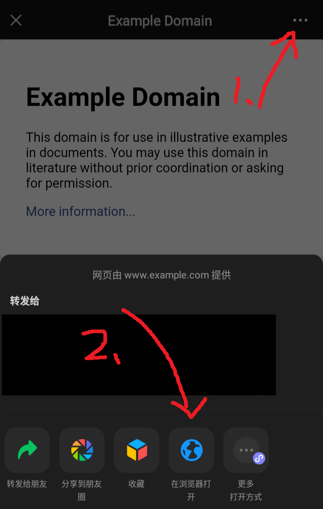
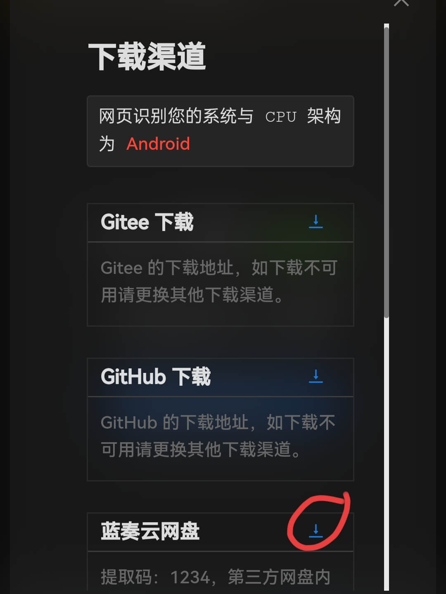
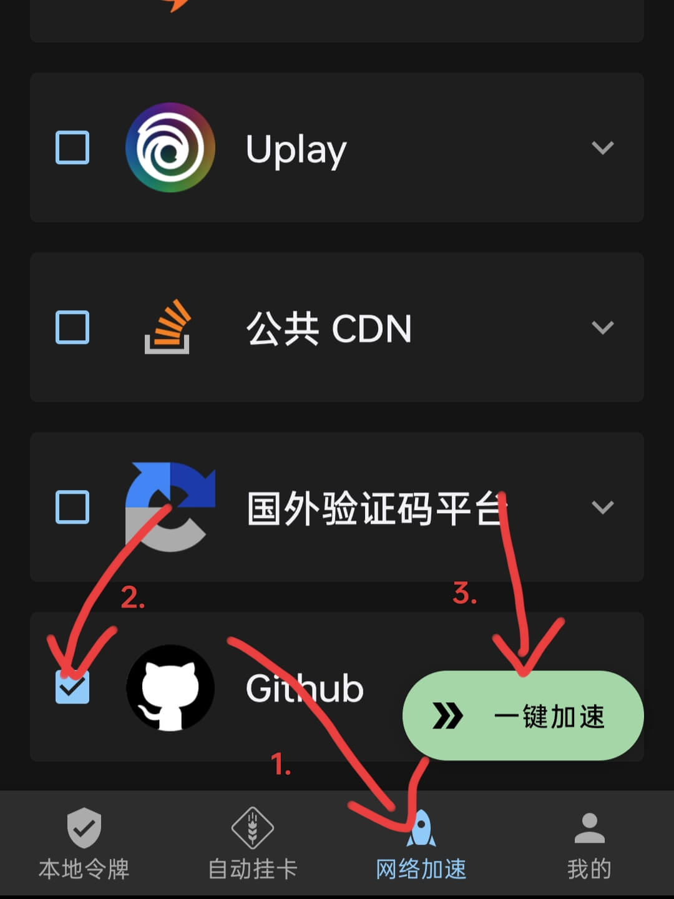
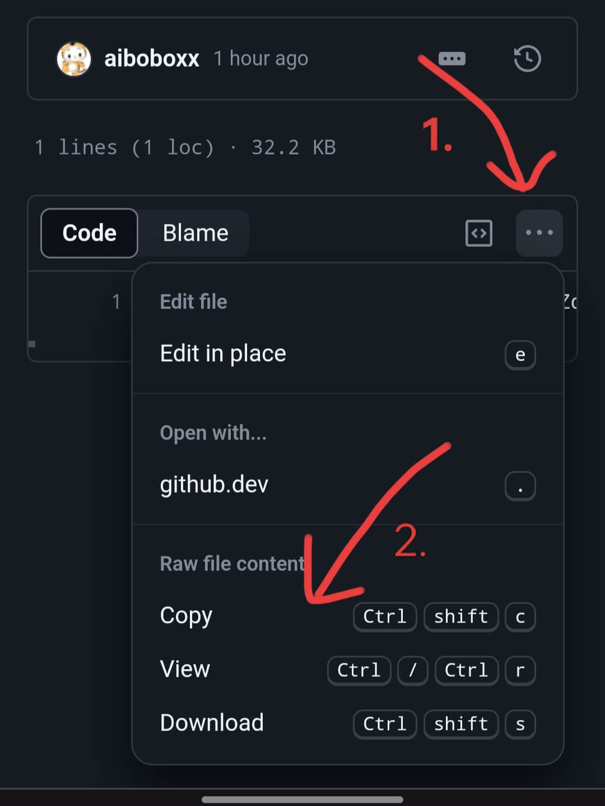
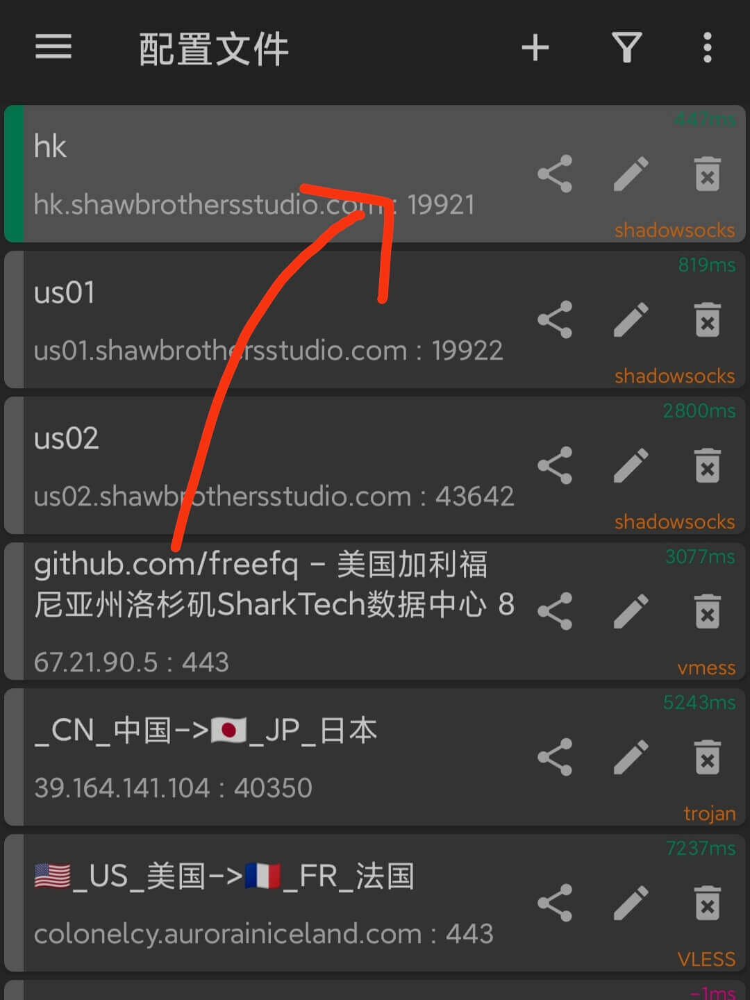
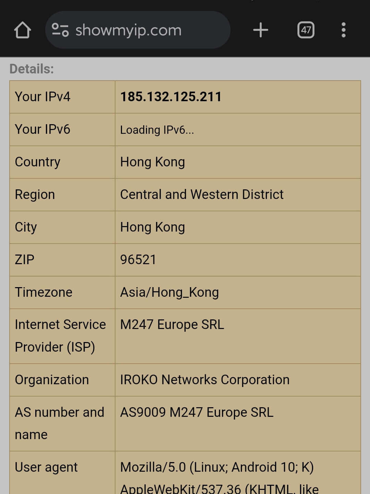

# 在网络监狱中自救——v2rayNG

> Tags: tutorial, article, chinese

> *很不幸, 你生在了一所信息上的监狱。*
> 这是一个没有谷歌, 没有维基百科, 没有OpenAI, 没有Github, 网络资源不到全体5%的荒原。如同太平洋中心的尼莫点, 与世隔绝。
> 一些公司, 凭借着令人讨厌的敏锐, 垄断了大陆市场, 窃取用户的隐私, 拿着他们畸形的软件, 赚得盆满钵满。
> 可悲的是, 几亿网民根本没有察觉, 甚至为它们摇旗呐喊。
>
> 

**!IMPORTANT!: 免费节点并不可靠，仅供临时或应急使用。一个付费，但价格相对优惠的机场：[快帆云](https://kf.kxzy.eu.org/)** 
(对VPN研究不深，也许有更加划算的节点，这里仅作参考)

## 0. 确保位于正确环境

1. 如果你在微信内部打开了该链接，请点击窗口标题栏的 **···** 按钮，再点击 **在浏览器打开** 以切换至系统默认浏览器。
   

## 1. 配置

### 第一部分

在Github上，有一个专门设立的免费v2ray节点仓库，每日更新。但尴尬的是，访问Github本身就需要翻墙 😅。因此，在这一部分，我们将首先获得对Github的访问。

1. 尝试[点击这里](https://github.com/aiboboxx/v2rayfree/blob/main/v2)，正常情况下，你将在漫长地等待后收到一个浏览器返回的错误信息。然而，如果你能打开它，那么，幸运儿，请直接跳转到[第二部分](#第二部分)吧。要相信，*爱，魔法，和奇迹是总会存在的*。

2. 如若幸运女神没有眷顾你，那我们就需要借助一些工具了。访问[Watt Toolkit 官网](https://steampp.net/)，点击 **下载 Android 版**，然后指定 **蓝奏云网盘下载**。
   

3. 安装下载好的APK*（对于部分手机，需要断网后才可以安装）*。按照下方图片，选择 **Github**，并选择 **一键加速**，随后按软件向导完成剩余步骤。
   

### 第二部分

1. 你可以使用以下方式来下载v2rayNG的安装包：

   + <https://wwf.lanzoul.com/iDYtS1qs6axa>
     密码:173x
     (假如链接失效请通知作者)

2. 安装下载的APK，[前往Github中存放免费节点的仓库](https://github.com/aiboboxx/v2rayfree/blob/main/v2)。如图，复制全部节点的Base64编码
	> 有时，你会失望地发现Github仍无法访问，那么，请尝试先断开[第一部分](#第一部分)中 *Watt Toolkit* 中对Github的加速，再重新连接。如果仍无法解决，换个良辰吉日重试吧😂。

	

4. 点击v2rayNG上方控制栏的 **+** 按钮，然后选择 **从剪贴板导入**。
	

5. 点击右上角的 **⋮** 按钮，选择 **测试全部配置真连接** 。测试完成后，再次点击 **⋮** 按钮，选择 **按测试结果排序** 。
	
	

7. 滚动到页面顶部，点击最上方的一栏。（不一定是图示的一栏，以实际情况为准）
   

8. 点击应用右下方的 **V** 按钮。（如果弹出类似 “是否运行v2rayNG创建VPN连接” 的对话框，选择允许）
   

9. 恭喜，现在自由互联网的大门才真正向你敞开！
   

## 2. 其它设置

### 2.1 如何断开与服务器的连接

1. 打开v2rayNG软件，再次点击应用右下方的 **V** 按钮，如果其变为灰色，则说明已经断开连接。

### 2.2 修复 连接后仍然不起作用的问题

1. 由于我们使用的都是免费节点，所以难免出现连接不稳定的现象，这时可能需要重新切换VPN服务器：打开v2rayNG，重复 第一部分 步骤4-步骤7 ，来选择最当前最适合的服务器。
   

## 3. 附录

- v2rayN是开源软件，其仓库位于https://github.com/2dust/v2rayNG。
- 节点由Github仓库 **[v2rayfree](https://github.com/aiboboxx/v2rayfree)** 提供
- 免费的节点可能只在一段时间内可用，如果希望连接更加稳定快速，有一个价格较为优惠的付费机场：[快帆云](https://kf.kxzy.eu.org/)