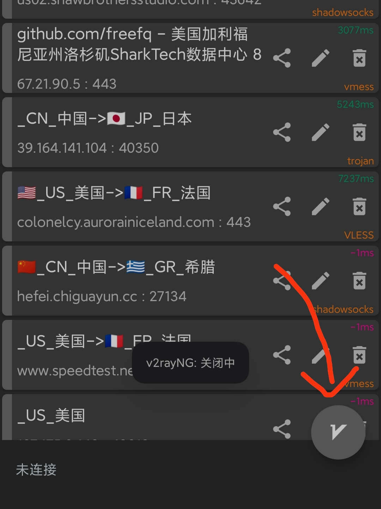

# 详细介绍Windows端的免费翻墙方式——v2rayNG

> Tags: tutorial, article, chinese

## 0. 确保位于正确环境

1. 如果你在微信内部打开了该链接，请点击窗口标题栏的 **···** 按钮，再点击 **在浏览器打开** 以切换至系统默认浏览器。如果你未发现类似标识，请忽略此步。
   

## 1. 基本使用

1. 你可以使用以下方式来下载软件的安装包：
   访问网址：https://www.123pan.com/s/ArpbVv-nu3xh.html，点击 **下载文件** ，等待下载完成。（假如链接失效请通知作者）
   
2. 安装下载的APK，[前往此处](./assets/servers.txt) 复制全部节点配置信息，然后打开桌面上的v2rayNG。
   
3. 点击v2rayNG上方控制栏 **+** 按钮，然后选择 **从剪贴板导入**。[（剪贴板未被写入 或 未导入任何服务器？）](https://xiuhengwu.github.io/how-to-use-v2rayng/servers.html)
    
4. 点击 **⋮** 按钮，选择 **测试全部配置真连接** 。
    
5. 再次点击 **⋮** 按钮，选择 **按测试结果排序** 。
   
6. 滚动到页面顶部，点击最上方的一栏。（-1表示暂时无法连接该服务器）（不一定是图示的一栏，以实际情况为准）
   
7. 点击应用右下方的 **V** 按钮。（如果弹出类似 “是否运行v2rayNG创建VPN连接” 的对话框，选择允许）
   
8. 恭喜，现在自由互联网的大门才真正向你敞开！
   

## 2. 其它设置

### 2.1 断开连接后如何再次连接

1. 你可以直接再次点击应用右下角点击 **V** 按钮，或者更加规范的做法是：重复 第一部分 步骤4-步骤7。

### 2.2 如何断开与服务器的连接

1. 打开v2rayNG软件，再次点击应用右下方的 **V** 按钮，如果其变为灰色，则说明已经断开连接。
   

### 2.3 修复 连接后仍然不起作用的问题

1. 由于我们使用的都是免费节点，所以难免出现连接不稳定的现象，这时可能需要重新切换VPN服务器：打开v2rayNG，重复 第一部分 步骤4-步骤7 ，来选择最当前最适合的服务器。
   

## 3. 附录

- v2rayN是开源软件，其仓库位于https://github.com/2dust/v2rayNG，目前我所提供的版本是截至2023.10.15的最新 Android 正式版本，[你可以参见此处](https://github.com/2dust/v2rayNG/releases)。
- 目前我提供的免费节点都来源于互联网，你也可以[通过谷歌搜索获取更多免费节点](https://www.google.com/search?q=v2ray免费节点&newwindow=1&sca_esv=573435106&sxsrf=AM9HkKkiRQspuzMvNTAGT6xmQP7AnqBjoQ%3A1697284699528&ei=W4IqZd_bH8Xn2roPsbad2AQ&ved=0ahUKEwif9eOcvvWBAxXFs1YBHTFbB0sQ4dUDCBA&uact=5&oq=v2ray免费节点&gs_lp=Egxnd3Mtd2l6LXNlcnAiEXYycmF55YWN6LS56IqC54K5MgQQABhHMgQQABhHMgQQABhHMgQQABhHMgQQABhHMgQQABhHMgQQABhHMgQQABhHMgQQABhHMgQQABhHSIsJUIMHWIMHcAF4ApABAJgBAKABAKoBALgBA8gBAPgBAcICChAAGEcY1gQYsAPiAwQYACBBiAYBkAYK&sclient=gws-wiz-serp)，但请注意并非每个来源于互联网的节点都免费、安全、可靠。
- 免费的节点可能只在一段时间内可用，如果希望连接更加稳定快速，推荐一个付费的VPN客户端：[Express VPN](https://www.expressvpn.com/)。