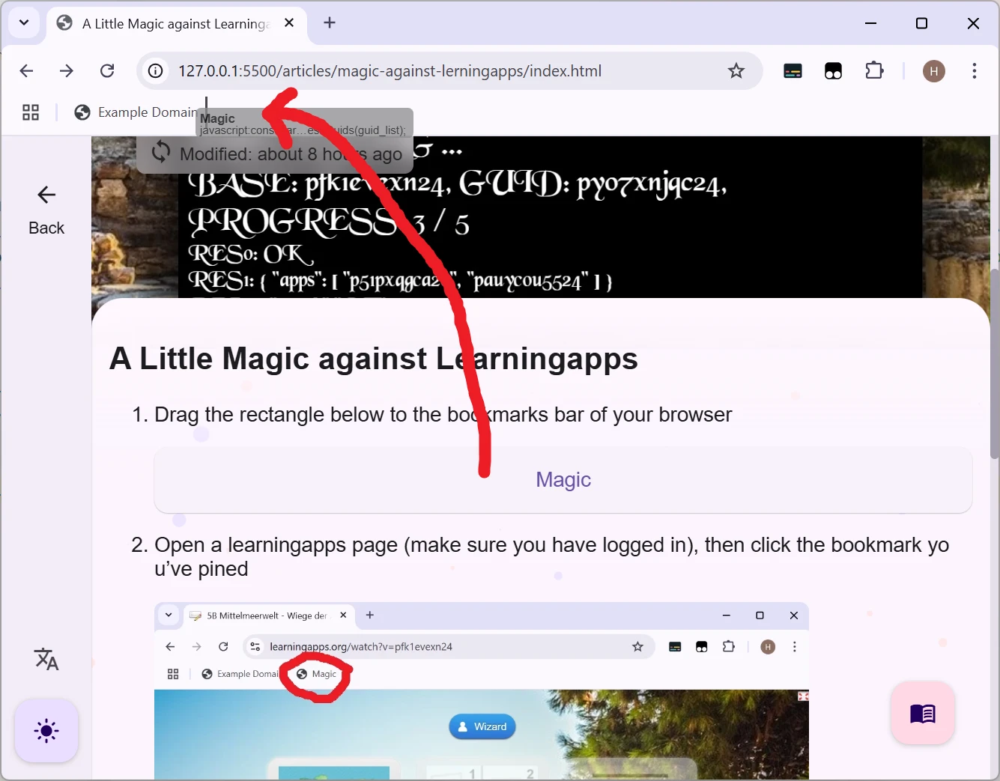
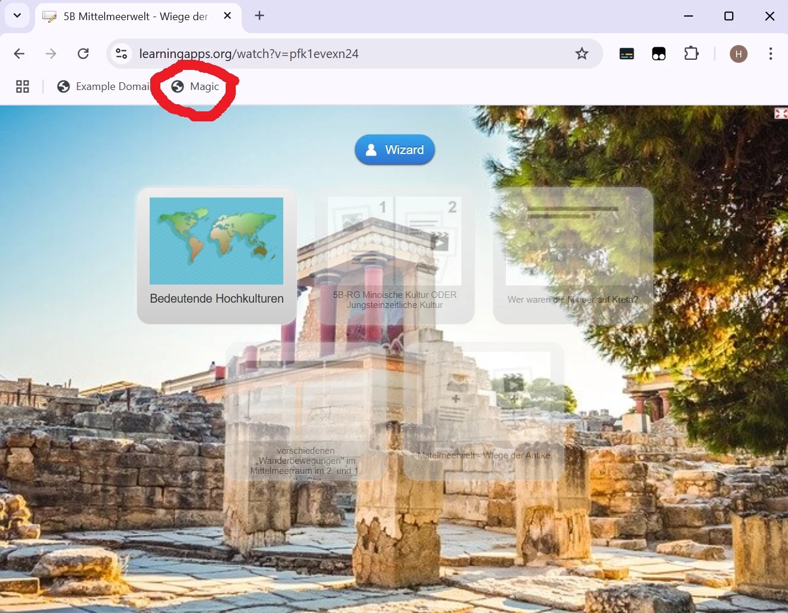

# A Little Magic against Learningapps

> Tags: tutorial, article, english

> **PLEASE NOTICE: This program is only a piece of art, don't actually rely on it to complete your works**

1. Drag the rectangle below to the bookmarks bar of your browser

<a href="https://xiuhengwu.github.io/articles/magic-against-lerningapps/index.html">Magic</a>

2. Open a learningapps page, then click the bookmark you've pined

3. See the magic happens ...

   <video src="step-3.mp4">